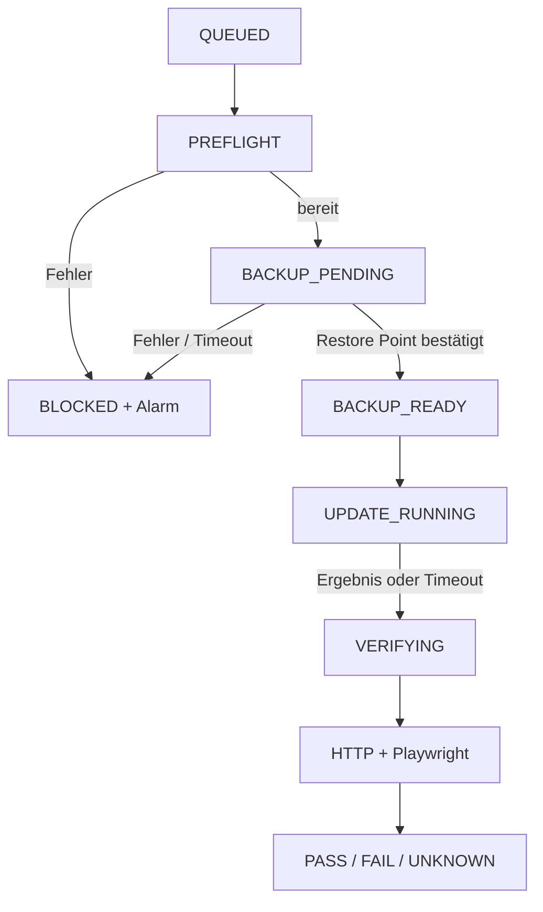

# MS Update Guard – Entwicklerspezifikation

**Version:** 1.0, 26.09.2026  
**Auftraggeber:** Marius Sonnentag  
**Zielsystem:** MainWP-Dashboard für ca. 70+ betreute WordPress-Installationen  
**Status:** Umsetzungsbriefing mit verpflichtender Machbarkeitsprüfung der Integrationen

> Diese Datei ist die unveränderte Auftragsgrundlage. Umsetzung und Abweichungen: [`ap0-schnittstellenmatrix.md`](ap0-schnittstellenmatrix.md), [`abnahme.md`](abnahme.md), [`betrieb.md`](betrieb.md).

## 1. Ziel und Systemgrenze

Ein zentrales Plugin auf dem **MainWP-Dashboard** steuert und protokolliert freigegebene automatische Updates. Vor einem Update muss ein zuordenbarer, abgeschlossener und verwendbarer Restore Point von WP Time Capsule (WPTC) bestätigt sein. Nach jedem Updateversuch führt ein **externer** Runner HTTP- und, falls konfiguriert, Playwright-Tests aus. Fehlende oder fehlerhafte Signale führen zu einer Meldung. Die Lösung bleibt funktionsfähig, wenn die aktualisierte Child-Site einen HTTP 500 liefert.

**Kernregel:** Ein *vom Guard gesteuertes* Update darf erst beginnen, wenn für genau diese Site und dieses Updatefenster `BACKUP_READY` belegt und persistent gespeichert ist. Ein Backup-Start, ein Zeitstempel eines älteren Backups oder eine bloße Erfolgsmeldung des Trigger-Requests sind kein Nachweis.

Der Guard wird **nur auf dem MainWP-Parent** installiert. Auf Child-Sites sind MainWP Child und WPTC bereits Teil des vorhandenen Stacks; es wird kein zusätzliches Playwright-Trigger-Plugin ausgerollt. MS Integrity Guard bleibt ein getrennter Sensor und ist keine Voraussetzung für die Updatefreigabe. MainWP Regression Testing läuft ergänzend über seine eigene Konfiguration.

### Warum diese Spezifikation eine Machbarkeitsprüfung enthält

Die öffentlich beschriebenen Funktionen der MainWP Time Capsule Extension belegen zentrale Verwaltung von WPTC, aber keine verbindliche, atomare Sequenz „frisches Backup vollständig → alle MainWP-Auto-Update-Pfade erst danach freigeben“. Die gewünschte Kopplung ist auf MainWPs Feature-Board weiterhin als **In Review** gelistet. Deshalb darf die Umsetzung weder einen fertigen `BACKUP_READY`-Hook noch einen universellen `UPDATE_FINISHED`-Hook voraussetzen. Beide Schnittstellen sind am tatsächlich eingesetzten Versionsstand zu belegen. [1][2]

## 2. Funktionsumfang der ersten Version (MVP)

| ID | Muss-Anforderung | Nachweis / Abnahme |
| --- | --- | --- |
| F01 | Site, Updateart, Komponente, Sollversion und Istversion erfassen; pro Site höchstens ein aktiver Lauf. | Zwei gleichzeitige Jobs derselben Site starten nicht parallel. |
| F02 | WPTC-Backup anfordern oder frischen Restore Point nach einer dokumentierten Regel verwenden; Backup-ID, Zeit, Umfang und Remote-Status speichern. | Ein offener, fehlgeschlagener, nicht zuordenbarer oder nur lokal vorhandener Restore Point sperrt das Update. |
| F03 | Verwendbarkeit des Restore Points prüfen: WordPress-Dateien **und** Datenbank enthalten; externes Ziel meldet Abschluss; vor Updatebeginn erstellt und innerhalb des festgelegten Zeitfensters. | Erfolgsfall und alle Negativfälle mit Staging demonstriert. |
| F04 | Erst nach F02/F03 das MainWP-Update für die beabsichtigten Komponenten starten; Ergebnis pro Komponente erfassen. | Zeitfolge im Journal zeigt `BACKUP_READY` vor `UPDATE_STARTED`; bei Backupfehler kein Guard-Update. |
| F05 | Nach Erfolg, explizitem Fehler **oder ausbleibendem Ergebnis** externen HTTP-Test auslösen; bei erreichbarer Site anschließenden Playwright-Test nach Site-Profil. | HTTP 500 während des Updates führt trotzdem zu `CRITICAL` mit Lauf-ID. |
| F06 | Neue Version unabhängig vom Update-Response durch erneuten MainWP-Sync bzw. Versionsabfrage prüfen; divergierende Ergebnisse als `UNKNOWN` markieren. | Simulierter Abbruch ohne Callback wird nicht als Erfolg gewertet. |
| F07 | Jedes Zustandsereignis dauerhaft und mit Zeitstempel protokollieren; Alarm mit Site, Komponente, Fehler, Backup-ID, Testergebnis und Link zum Lauf versenden. | Bericht nach Abbruch/Neustart des Parent weiter vorhanden. |
| F08 | Zeitlimits, wiederholte Zustellung, Deduplication und manuelle Wiederaufnahme anbieten. | Doppelte Webhooks verursachen weder Doppelupdate noch widersprüchliche Abschlusszustände. |
| F09 | MainWP Regression Testing getrennt für Post-Update-HTML-Vergleich aktivierbar; Status nur dann in der Guard-Ansicht anzeigen, wenn eine **nachweisbare Ergebnis-Schnittstelle** vorhanden ist. | Fehlende Integration wird als `nicht angebunden`, niemals als `PASS` angezeigt. |
| F10 | Rollenbasierte Administration, Geheimnisverwaltung, sichere Webhooks und beschränkte Testziele. | Tests gegen nicht freigegebene Hosts und gefälschte Callbacks werden abgewiesen. |

**Nicht Bestandteil des MVP:** automatisches Rollback; Checkout-Zahlung mit echtem Geld; Pixel-Diff für alle Sites; automatische Änderungen am MS Integrity Guard; verbindliche Steuerung beliebiger Updates außerhalb der Guard-Pipeline.

## 3. Technische Vorprüfung (verpflichtendes Arbeitspaket 0)

Der Entwickler erstellt zuerst eine **Schnittstellenmatrix für die konkret installierten Versionen** von MainWP Dashboard, MainWP Child, MainWP Time Capsule Extension, WPTC und Regression Testing. Für jede Zeile: Version, dokumentierter oder quelltextgeprüfter Hook/API, Aufrufkontext, Rückgabe, Fehlerverhalten, Beleg aus Quellcode/Doku und reproduzierbarer Staging-Test.

1. Kann das Dashboard ein WPTC-Backup **gezielt** starten, dessen Job-/Restore-Point-ID abrufen und den **Abschluss im konfigurierten Remote-Speicher** sowie Dateien/DB verlässlich feststellen? Wenn nein: eine unterstützte WPTC-Schnittstelle klären. Kein Scraping der Admin-Oberfläche als harte Sicherheitsgarantie.
2. Kann der Guard **alle gewählten MainWP-Auto-Update-Pfade vor Ausführung** blockieren beziehungsweise durch einen eigenen Scheduler und eine unterstützte MainWP-Update-Schnittstelle ersetzen? Relevante Pfade: Plugin, Theme, Core; Einzel- und Bulk-Updates; periodische Auto-Updates. Ein reiner „after update“-Hook reicht nicht für die Backup-Schranke.
3. Ist ein belastbares per-Komponente-Updateergebnis verfügbar, einschließlich Fehler/Timeout, oder muss der Guard das Ergebnis durch erneuten Sync und Versionsvergleich rekonstruieren?
4. Wie werden Child-eigene WordPress-Auto-Updates, WPTC-eigene Updates, MainWP-Manuell-Updates und Updates durch weitere Plugins gehandhabt? Für einen garantierten Guard-Pfad müssen überlappende Auto-Update-Mechanismen entweder deaktiviert oder nachweislich ebenfalls vorgeschaltet werden. Nicht erfasste Updates sind im Bericht als **außerhalb des Guard** zu kennzeichnen.
5. Lässt sich das MainWP Regression Testing Ergebnis pro Update-Lauf zuordnen? Falls nicht: eigene Regression-Mails/Ansicht belassen und keine falsche Gesamtstatus-Aggregation bauen.

**Gate:** Erst wenn (1) Backup-Abschluss und (2) Kontrolle *vor* Updatebeginn belegbar sind, darf die Entwicklung als „Backup-gated Auto-Update“ fortgesetzt werden. Andernfalls liefert der Entwickler einen kurzen Alternativvorschlag (z. B. eigener MainWP-gesteuerter Scheduler statt nativer MainWP-Auto-Update-Queue) mit Auswirkungen auf Aufwand und Sicherheit. Die harte Schranke darf nicht durch einen best-effort-Zeitabstand ersetzt werden.

## 4. Zustandsautomat

Ein `run_id` bezeichnet einen Updateversuch **einer Site** und einer explizit gespeicherten Menge von Komponenten. Eine Site bleibt für weitere Guard-Updates gesperrt, solange ein Lauf nicht abgeschlossen oder manuell geklärt ist.



**PREFLIGHT:** Child erreichbar; Update vorhanden; Soll-/Istversion gesichert; WPTC-Verbindung und Speicherziel einsatzfähig; Testprofil und Ziel-URLs definiert. Optionaler Vorab-HTTP-Test speichert einen bereits vorhandenen Defekt, damit dieser nachher nicht dem Update zugeschrieben wird. Ein solcher Defekt blockiert standardmäßig bis zur manuellen Freigabe.

**BACKUP_PENDING:** Der Parent fragt den Jobstatus bis zum konfigurierbaren Timeout ab. Polling mit begrenzter Backoff-Folge; kein dauerhaft blockierender PHP-Request. Nach einem Parent-Neustart wird derselbe Job anhand der persistierten ID fortgeführt.

**BACKUP_READY:** Restore-Point-ID, Zeit, enthaltene Daten, Remote-Ziel und Prüfnachweis sind gespeichert. Bei mehreren Komponenten in einem Lauf genügt ein frischer Restore Point unmittelbar vor *dieser* Gruppe; ein neuer, späterer Lauf erfordert erneut eine Freigabe. WPTC-Wiederherstellung wird im Pilot auf Staging tatsächlich geprüft; Metadaten allein beweisen keine Restore-Fähigkeit.

**UPDATE_RUNNING:** MainWP führt die gespeicherte Komponentenliste aus. Pro Komponente werden Startzeit, Response, Istversion nach Resync und Fehler hinterlegt. Für unbekanntes Ergebnis kein blindes Retry des Updates; erst Status klären.

**VERIFYING:** Auch bei Fehler und Timeout wird vom Parent aus ein externer HTTP-Test angestoßen. Bei 500/Timeout ist der Playwright-Durchlauf optional beziehungsweise als `SKIPPED_HTTP_FAILURE` zu markieren. Bei HTTP-Erfolg läuft das zugeordnete Smoke-Test-Profil. Kein gemeldeter Testerfolg nach Frist = `UNKNOWN` und Alarm.

**Terminalstatus:** `PASS` nur bei verifizierter Sollversion, bestandenem HTTP-Test und allen obligatorischen Smoke-Tests. `FAIL` bei nachgewiesenem Update- oder Testfehler; `UNKNOWN` bei unvollständigen/inkonsistenten Nachweisen; `BLOCKED` vor Updatebeginn. Zustände und Ergebnisse von MainWP Regression Testing bleiben eine eigene Dimension.

## 5. Ereignis- und Schnittstellenvertrag

Der Code verwendet austauschbare Adapter statt fest kodierter interner MainWP-/WPTC-Funktionen:

```text
UpdateInventory      -> list_pending(site_id)
BackupProvider       -> start(site_id, run_id), status(job_id), restore_point(job_id)
UpdateExecutor       -> start(site_id, components, run_id), status(run_id)
VersionVerifier      -> resync_and_compare(site_id, components)
ExternalTestRunner   -> start(run_id, site_profile), status(test_id)
Notifier             -> send(severity, run_id, evidence)
```

**Beispiel-Payload an den Runner:**

```json
{
  "run_id": "e5b7c036-3c47-4c3e-ae12-3a7e1b17fe4b",
  "site_id": 43,
  "profile_id": "corporate-basic",
  "trigger": "update_finished_or_timeout",
  "issued_at": "2026-09-26T20:40:00Z",
  "expires_at": "2026-09-26T20:45:00Z"
}
```

Der Runner löst Site-URL und freigegebene Pfade aus seiner eigenen Konfiguration anhand von `site_id`/`profile_id` auf; er akzeptiert **keine frei übergebene Ziel-URL**. Der Auftrag ist mit HMAC über die unveränderten Bytes signiert, enthält Zeitgrenze und einmalige Ereignis-ID; HTTPS und Schlüsselrotation sind erforderlich. Callback und Statusabfrage nutzen getrennte Rechte/Secrets. `run_id` ist Idempotenzschlüssel. Ein angenommener Trigger (`202 Accepted`) ist noch **kein** Testergebnis. Nach Timeout fragt der Parent den Runnerstatus erneut ab und alarmiert bei weiter fehlendem Ergebnis. Responses dürfen keine Zugangsdaten, Formularinhalte oder personenbezogene Testdaten im Log ablegen.

**Runner-Resultat:** `run_id`, `test_id`, Start/Ende, `HTTP_PASS|HTTP_FAIL|HTTP_UNKNOWN`, `SMOKE_PASS|SMOKE_FAIL|SMOKE_SKIPPED|SMOKE_UNKNOWN`, einzelne Checks mit knapper Fehlermeldung und geschützter Artefakt-Referenz (Screenshot/Console-Auszug). Ein Fehler im Runner selbst ist `UNKNOWN`, niemals `PASS`.

## 6. Tests, Profile und Alarmierung

**HTTP-Check:** aus externer Umgebung, TLS-Zertifikat gültig, erwartete Domain nach Redirect, Antwortstatus und relevanter Inhalt/Marker. `200` allein ist kein Funktionsnachweis. Cache/CDN-Verhalten im Testprofil berücksichtigen; nur freigegebene Hostnamen ansteuern. Initiale Wartezeit nach Update konfigurierbar (Vorschlag 30–60 s), danach wenige begrenzte Wiederholungen, damit kurzes Cache-Warming keinen Fehlalarm auslöst.

**Corporate-Basisprofil:** Startseite, zentrale Leistungsseite und Kontaktseite laden; wichtige Navigation/CTA/Formular existieren; keine definierte kritische JS-Exception. Formularversand nur mit explizit eingerichtetem Testformular beziehungsweise sicherem Testziel, damit keine echten Leads, Automationen oder Kundendaten ausgelöst werden.

**WooCommerce-Profil:** Produkt öffnen, in den Warenkorb legen, Warenkorb und Checkout öffnen; Checkout bis vor eine echte Zahlung prüfen. Vollständige Bestelltests ausschließlich über Sandbox-Gateway und festgelegte Testprodukte. Für geschützte Seiten Testkonten mit minimalen Rechten und sicher gespeicherten Credentials nutzen.

**MainWP Regression Testing:** automatisch nach Updates aktivieren und Zeitverzögerung passend zu Cache/CDN einstellen. Diese Erweiterung vergleicht gerendertes HTML; sie ist kein Ersatz für Formular- oder Checkout-Interaktion. Laut MainWP kann der Post-Update-Scan um 1–60 Minuten verzögert werden. [3][4]

**Prioritäten:** `CRITICAL` bei HTTP 500/Timeout, fehlendem Runner nach Frist oder Update mit nicht aufklärbarem Status und möglichem Ausfall; `ERROR` bei Smoke-Test-Fehler oder fehlgeschlagenem Update mit erreichbarer Site; `WARNING` bei fehlendem Backup, wodurch **kein Update** stattfindet. Bestehende Better-Stack-/Uptime-Kanäle können die Zustellung übernehmen. Alarm-Deduplication je `run_id`/Fehlerbild, erneute Erinnerung bei ungelöstem Vorfall. Ein **externer Heartbeat für den Parent-Scheduler** meldet auch dann, wenn der gesamte Parent ausfällt und selbst keinen Alarm mehr auslösen kann.

## 7. Betrieb und Sicherheit

- Eigene Tabellen für Läufe und unveränderliche Ereignisse; keine zeitkritische Queue ausschließlich über WP-Cron auf Seiten mit unregelmäßigem Traffic. Parent-Scheduler über System-Cron/zuverlässigen Worker, Wiederaufnahme nach Prozessabbruch und Limits für Parallelität (anfangs 1–3 Sites; je Site immer 1 Lauf).
- Konfiguration pro Site: Profil, Backup-Timeout, Update-Timeout, Test-Timeout, Wartungsfenster, kritische Komponenten und Alert-Kanal. Globale Defaults dienen nur als Vorschlag. Vor produktivem Rollout auf Pilot-Sites Kapazität von Parent, WPTC und Runner messen.
- Kein automatisches Rollback im MVP, da WPTC-Restore nach Nutzererfahrung gelegentlich fehlschlägt. Alarm nennt Restore-Point-ID und manuellen Recovery-Pfad über WPTC beziehungsweise Host/SSH/WP-CLI, auch wenn die Child-Site nicht bootet. Restore-Probe im Pilot auf Staging.
- Auf dem Parent ausschließlich benötigte MainWP-Rechte vergeben, Admin-Aktionen mit Capability-Check + Nonce absichern, gespeicherte Secrets schützen, Ausgaben escapen, Logs begrenzen und bereinigen. Alle Runner-/Site-Ziele an Allowlist und TLS binden; SSRF über frei konfigurierbare URLs verhindern.
- Sicherheitsupdates können einen separaten, bewusst freigegebenen Notfallprozess bekommen; jede Ausnahme von der Backup-Schranke muss sichtbar, mit Verantwortlichem und Begründung protokolliert sein. Updates außerhalb der Guard-Pipeline dürfen nicht als „Backup geprüft“ erscheinen.

## 8. Abnahmetests auf Staging

| Fall | Erwartetes Ergebnis |
| --- | --- |
| Backup erfolgreich, Remote-Status bestätigt, Update/Test erfolgreich | `PASS`, vollständige Ereigniskette mit Restore-Point-ID. |
| WPTC-Job läuft noch, scheitert, Remote-Sync fehlt oder läuft in Timeout | `BLOCKED`, **kein** Updateaufruf, Alarm. |
| Backup-ID gehört zu anderer Site, ist zu alt oder nur DB-Backup | `BLOCKED`, mit begründeter Abweisung. |
| Child liefert nach Update HTTP 500 oder stirbt vor einem Callback | Parent startet externen Check; `CRITICAL` und kein fälschlicher `PASS`. |
| Update-Response meldet Erfolg, Istversion bleibt unverändert | `UNKNOWN`/`FAIL`, kein Erfolg allein aufgrund des Responses. |
| HTTP 200, Formular-/Warenkorb-Test scheitert | `FAIL`, konkreter Test und Artefakt. |
| Parent-/Runner-Neustart, doppelte Callback-Zustellung | Lauf wird fortgesetzt, keine Doppelupdates/-alarme. |
| MainWP-/WordPress-Update auf nicht vom Guard kontrolliertem Pfad | Als außerhalb der Garantie sichtbar oder technisch unterbunden. |
| Regression Testing nicht angebunden | Eigener Status „nicht angebunden“; kein `PASS` dafür. |
| Parent-Scheduler steht still | Externer Heartbeat meldet Ausfall innerhalb definierter Frist. |

## 9. Liefergegenstände und Reihenfolge

1. **Machbarkeitsnachweis:** Schnittstellenmatrix, Staging-Protokoll, Entscheidung über Update-Scheduler und dokumentierte Reichweite der Backup-Schranke.
2. **MVP:** installierbares MainWP-Parent-Plugin, DB-Migration, Adapter, Konfiguration, Ereignisjournal, Alarmierung und Runner-Vertrag; Runner mit HTTP-Check sowie Basis- und WooCommerce-Testprofilen.
3. **Betriebsdokumentation:** Einrichtung von WPTC und MainWP, Abschaltung/Einbindung konkurrierender Updatewege, Secrets, Cron, Runbook für `BLOCKED`/`UNKNOWN`/`FAIL`, manuelle Recovery sowie Versionen der unterstützten Integrationen.
4. **Staging-Abnahme und Pilot:** die Fälle aus Abschnitt 8 automatisiert oder nachvollziehbar demonstrieren; zuerst wenige unterschiedliche Websites (Corporate, WooCommerce, Spezialintegration), dann gestaffelte Freigabe des Bestands.

**Definition of Done:** Die Abnahmetests sind erfüllt; für jeden automatisch ausgeführten Guard-Updateversuch ist der Restore Point vor Start nachweisbar; bei 500/Timeout erfolgt unabhängig von der Child-Site eine externe Prüfung und Alarmierung; jede Abweichung ist im Parent einsehbar. Eine bloße Integration von Hooks ohne nachgewiesene Ablaufkontrolle erfüllt den Auftrag nicht.

## Quellen / technische Prüfgrundlage

[1] [MainWP Time Capsule Extension](https://mainwp.com/add-on/time-capsule/) – öffentlich beschriebener Funktionsumfang.  
[2] [MainWP Feature-Board: Backup before update aus Dashboard](https://voice.mainwp.com/p/update-from-dashboard-tigger-backup-auto-before-update-feature-wpvividwp-2) – Status „In Review“ bei Erstellung.  
[3] [MainWP Regression Testing](https://mainwp.com/add-on/regression-testing/) – Vergleich des gerenderten HTML und Post-Update-Scans.  
[4] [MainWP Regression Testing Changelog 5.2](https://mainwp.com/changelog/mainwp-regression-testing-extension/) – konfigurierbare Verzögerung 1–60 Minuten.  
[5] [WP Time Capsule: Backup vor Updates](https://wptimecapsule.com/features/) – Produktaussage, kein Nachweis einer MainWP-Transaktion.  
[6] [MainWP Developer Changelog](https://github.com/mainwp/mainwp.dev/blob/main/developer-changelog.md) – vorhandene Hooks sind versions- und kontextabhängig; konkrete Kontrollpunkte am installierten Stand prüfen.
